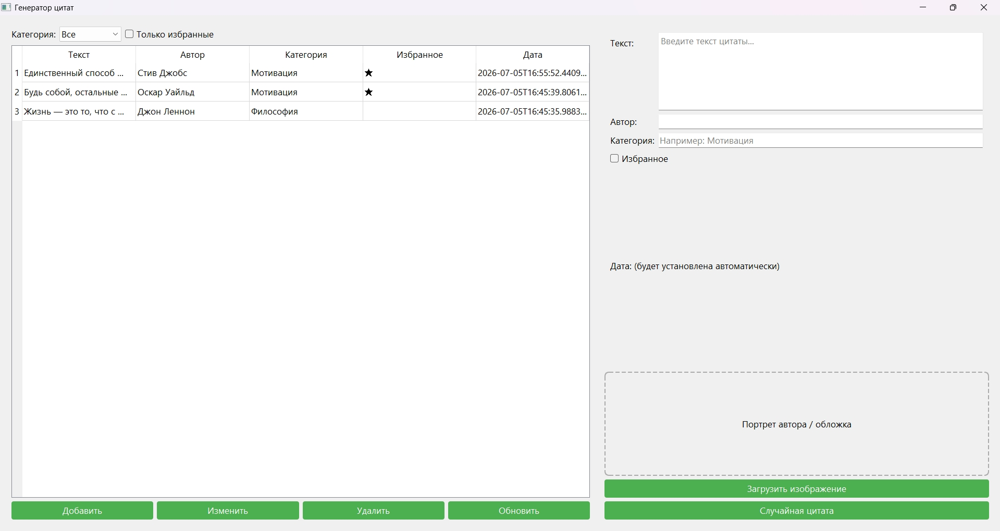
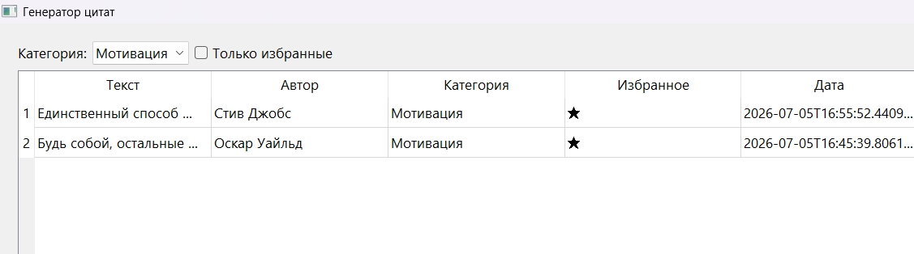

# Генератор цитат (PyQt5)

Приложение для хранения, редактирования и случайного выбора цитат с поддержкой изображений, фильтрации по категориям и избранному.

## Функционал
- Добавление, редактирование, удаление цитат
- Хранение в SQLite
- Загрузка и отображение изображений (Pillow)
- Фильтр по категориям и избранному
- Случайный выбор цитаты
- Адаптивный интерфейс с QSplitter

## Скриншоты

## Установка и запуск
1. Клонируйте репозиторий:  
   `git clone https://github.com/Medvedb-23/quote-generator.git`
2. Перейдите в папку: `cd quote-generator`
3. Создайте виртуальное окружение: `python -m venv venv`
4. Активируйте:  
   - Windows: `venv\Scripts\activate`  
   - Mac/Linux: `source venv/bin/activate`
5. Установите зависимости: `pip install -r requirements.txt`
6. Запустите: `python main.py`

## Используемые технологии
- Python 3.10+
- PyQt5
- SQLite (sqlite3)
- Pillow (обработка изображений)
- Git

## Структура проекта
- `main.py` – точка входа
- `ui_main.py` – интерфейс и логика
- `database.py` – работа с БД
- `requirements.txt` – зависимости
- `screenshots/` – скриншоты для документации